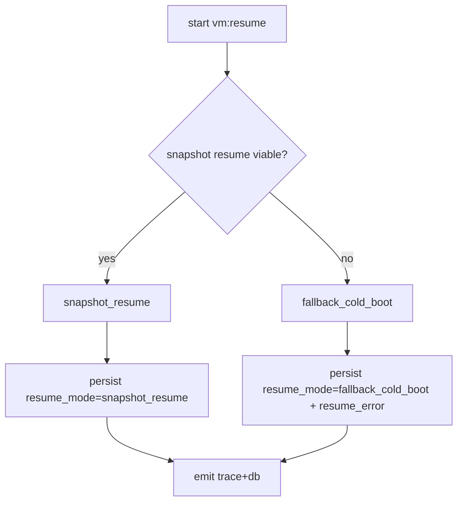

# Sequence Walkthroughs

## Smoke (deterministic)
```mermaid
sequenceDiagram
  participant H as Host script/cmd
  participant V as virmux(vm)
  participant F as Firecracker
  participant G as Guest ttyS0
  participant S as store+trace
  H->>V: vm:smoke (locked image)
  V->>F: create machine + boot
  F->>G: kernel/init=/bin/sh
  H->>G: uname -a; echo ok
  G-->>H: ...Linux...
  G-->>H: ...ok...
  H->>F: SIGTERM (deterministic stop)
  V->>S: persist run/events + trace.ndjson (compat trace.jsonl symlink)
  S-->>H: success
```

## Resume (robust)


## DAG behavior (mise)
```text
if sources unchanged AND outputs present -> SKIP (expected)
if forced rerun needed -> mutate source/output or clean target
```
