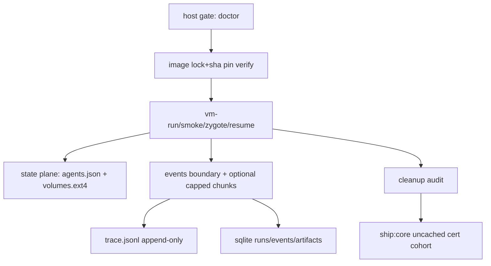

# ADR-002: Spec-0/02 Contract Closure (Determinism > Throughput)
Date: 2026-02-22
Status: Accepted
Supersedes: none
Related: `docs/adr/001-firecracker-contract-first-harness.md`, `spec-0/00-learnings.jsonl`, `spec-0/02-*.jsonl`, `spec-0/02/*.jsonl`

## Context (compressed)
Spec-0/02 moved from “boot works” to “ship certifiable”: immutable inputs, explicit state plane, total resume telemetry, append-only evidence, executable cleanup, uncached ship lane. Prior failures: dead resume path (FC400), fallback short-circuit, null resume keys, false-green bench/sql cert via historical rows, cache-skip ship lane, artifact hashing on sockets, URL mutability in image pipeline.

## Decision
Adopt **7-plane contract**; reject convenience paths.

1. Runtime plane: Ubuntu 24.04 bare-metal, `/dev/kvm` rw, Firecracker via go-sdk only.
2. Image plane: lock-selected immutable cache dir `.cache/ghostfleet/images/<sha>/`; source bytes pinned+verified (`*_sha256`) and mixed into cache key.
3. Run plane: host drives `ttyS0`; success markers `Linux` + `ok`; deterministic completion via host stop/wait.
4. State plane: canonical agent metadata `agents/<id>.json`; mutable bytes only `volumes/<id>.ext4`; rootfs RO + `rootflags=noload`.
5. Resume plane: attempt snapshot once; any resolve/load/wait fault => `StopVMM+Wait` then cold boot; terminal telemetry always non-null: `resume_mode`,`resume_source`,`resume_error`.
6. Evidence plane: dual-write order fixed `trace emit -> sqlite insert`; trace append-only; sqlite WAL+FK+indexes; artifacts registry metadata-complete (regular file hash, non-regular `sha256=meta:*`).
7. Release plane: dev DAG may skip; ship lane must execute uncached and prove fresh cohort rows.

## Why (hard rationale)
- Determinism breaks first at boundaries: host capability, mutable sources, resume semantics, cleanup leaks, historical-row contamination.
- “Fallback works” is safety, not success condition; snapshot fast-path must be continuously proven.
- Evidence must be query-first (sqlite/trace), not log-first.

## Invariants (non-negotiable)
- Mandatory VM phase events: `vm.boot.started`,`vm.exec.injected`,`vm.exit.observed`.
- `vm:resume` `run.finished` always includes canonical keys (no nulls).
- Cleanup gate executable: no orphan `firecracker`, no stale `runs/**/firecracker.sock`, no leaked `virmux-tap*`.
- Cert SQL on append-only DB is cohort-scoped (`label like 'qa-cert-%'`/session tag) unless legacy backfill exists.
- Runtime-critical wrappers rerun `./scripts/doctor.sh` directly (not only cached DAG).

## Architecture sketch


## Resume semantics (truth table)
| input state | snapshot attempt | post-fault action | terminal mode | status |
|---|---|---|---|---|
| valid mem+state | yes | none | `snapshot_resume` | `ok` |
| missing latest/agent snap | yes (resolve fault) | stop/wait + cold boot | `fallback_cold_boot` | `ok` |
| FC load/wait failure | yes | stop/wait + cold boot | `fallback_cold_boot` | `ok` |
| hard unrecoverable post-fallback | yes | emit fail terminal | `fallback_cold_boot` + error | `failed` |

## Walkthroughs (minimal chars, max signal)
### PO 15m proof
```bash
mise run doctor && mise run image:stamp
mise run vm:smoke -- --label po-smoke
mise run vm:zygote -- --agent poA --label po-zygote
mise run vm:resume -- --agent poA --label po-resume
go run ./cmd/virmux vm-run --agent poA --label po-w --cmd 'echo po >/dev/virmux-data/demo.txt; sync'
go run ./cmd/virmux vm-run --agent poA --label po-r --cmd 'cat /dev/virmux-data/demo.txt'
```
Pass: `po-resume.resume_mode=snapshot_resume`; `po-r` serial contains `po`.

### QA stop-ship spine
```bash
mise run ship:core
mise run trace:validate ::: db:check ::: qa:sql-contract ::: vm:cleanup:audit
```

### FDE abuse (prove fallback safety)
```bash
go run ./cmd/virmux vm-resume --agent fdeR --label fde-bad --mem-path /tmp/m.mem --state-path /tmp/m.state
```
Expect: `status=ok`, `resume_mode=fallback_cold_boot`, `resume_source=snapshot_resume_error`, `resume_error!=''`.

## SQL probes (contract-level)
```sql
-- resume telemetry totality (cohort-scoped)
select count(*) as bad
from events e join runs r on r.id=e.run_id
where e.kind='run.finished' and r.task='vm:resume' and r.label like 'qa-cert-%'
and (
 json_extract(e.payload,'$.resume_mode') is null or
 json_extract(e.payload,'$.resume_source') is null or
 json_extract(e.payload,'$.resume_error') is null
);
```
```sql
-- required VM boundary events on latest run
select kind,count(*) from events
where run_id=(select id from runs order by started_at desc limit 1)
group by kind;
```
```sql
-- artifact contract inventory
select path,sha256,bytes from artifacts where run_id=? order by id;
```

## Tradeoffs
- Added strictness increases early red builds; intentionally prevents ambiguous green.
- Cohort labels add operator burden; removes append-only DB ambiguity.
- Optional lanes stay isolated; core contract remains serial-first deterministic.

## Rejected alternatives
- Container runtime substitution: violates host/runtime parity and KVM contract.
- Mutable rootfs per run: breaks image immutability and cache determinism.
- Benchmarking on historical global rows: produces false-green SLOs.
- Socket-as-file hashing: non-regular inode semantics cause nondeterministic failures.

## Consequences
- Fast loops remain fast because dev DAG caching preserved.
- Ship confidence increases because cert path is execution-guaranteed and cohort-proven.
- Forensics speed improves: sqlite-first artifact/event lineage, bounded event cost.

## Adoption checklist
- `G0..G4` green.
- `ship:core` emits `tmp/ship-core-summary.json` with fresh cohort rows.
- `bench-snapshot-summary.json` enforces `total_samples==iterations` and `snapshot_resume_count>=1`.
- Learning log updated on each new failure class.
