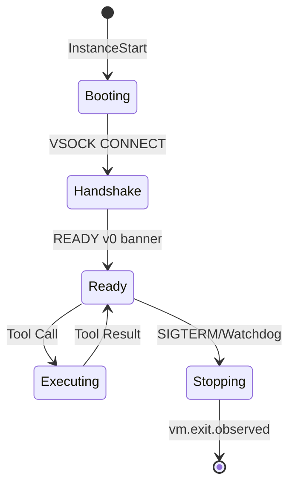

# Spec-03: Architectural Walkthrough

## 1. Trace Anatomy (NDJSON v2)
A tool call in Spec-03 produces a dense evidence trail.

```json
{"run":"1746","seq":10,"ts":17400000,"t":"vm.agent.ready","caps":["shell","fs","http"]}
{"run":"1746","seq":11,"ts":17400001,"t":"vm.tool.call","tool":"fs.read","ih":"sha256:e3b0..."}
{"run":"1746","seq":12,"ts":17400005,"t":"vm.tool.result","tool":"fs.read","oh":"sha256:4f2a...","rc":0,"ms":4}
```

## 2. Vsock Handshake Logic
Host-side dialer must be resilient to guest init delays.

```go
// internal/transport/vsock/dial.go
func DialWithRetry(uds string, port int, ctx context.Context) (net.Conn, error) {
    for i := 0; i < MaxRetries; i++ {
        c, err := net.Dial("unix", uds)
        if err == nil {
            fmt.Fprintf(c, "CONNECT %d
", port)
            // Expect "OK 52
"
            // Wait for "READY v0 tools=..."
            return c, nil
        }
        select {
        case <-ctx.Done(): return nil, ctx.Err()
        case <-time.After(Backoff(i)): continue
        }
    }
}
```

## 3. SQLite Schema (Tool Evidence)
Querying tool results without parsing logs.

```sql
-- select id from tool_calls where error_code = 'DENIED';
CREATE TABLE tool_calls (
    run_id TEXT,
    seq INTEGER,
    req_id INTEGER,
    tool TEXT,
    input_hash TEXT,
    output_hash TEXT,
    stdout_ref TEXT,
    stderr_ref TEXT,
    error_code TEXT,
    dur_ms INTEGER,
    FOREIGN KEY(run_id) REFERENCES runs(id)
);
```

## 4. Lifecycle State Machine



## 5. Export Determinism
The `tar` command used for bundling is brittle; we fix it.

```bash
# Deterministic Tar Contract
tar --sort=name 
    --mtime='UTC 1970-01-01' 
    --owner=0 --group=0 --numeric-owner 
    -C runs/$RID -cf - . | zstd -19 > bundle.tar.zst
```
