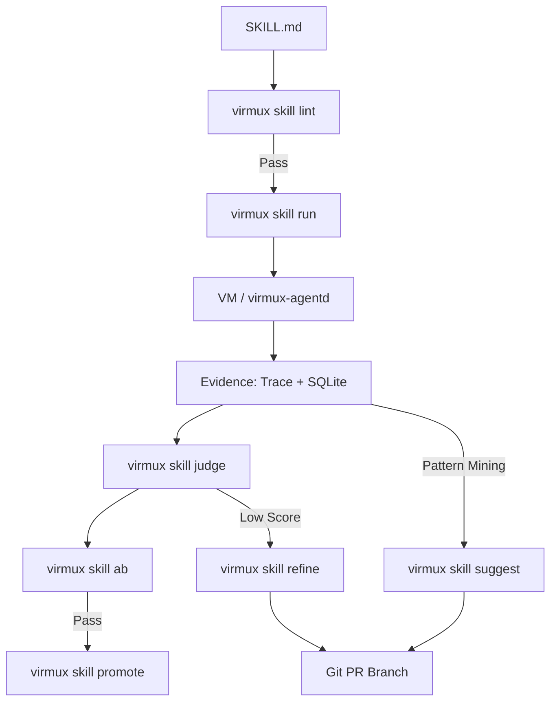

# ADR 004: Skill Plane (Spec-04) — Skills-as-Artifacts

## Status
**ACCEPTED** (Integrated via Spec-0/04 Cycles C0..C7)

## Context
Ad-hoc prompts fail at scale. Transitioning to **Skills-as-Artifacts**: promptware treated as versioned, testable code units. Leverage existing VM harness but optimize for a deterministic compounding loop: **Method → Run → Judge → Refine**.

## Decision: The Skill Contract
**1 Folder = 1 Skill.** No mega-skills. No "frameworks". 
*   `SKILL.md`: SoT. YAML frontmatter (metadata/gates) + Instructions.
*   `tools.yaml`: Strict tool allowlist + budgets (integer-only: `tool_calls`, `seconds`, `tokens`).
*   `rubric.yaml`: Criteria (format, completeness, etc.) + weights + pass/fail thresholds.
*   `tests/*.json`: Deterministic input fixtures.

## Decision: The Compounding Loop
Minimal CLI surface: `virmux skill <lint|run|judge|ab|refine|suggest|promote|replay>`.

### 1. Execution Plane
*   **Run:** `(skill@sha, fixture) → {artifacts, trace, score_placeholder}`.
*   **Replay:** Parity check (tool I/O hashes + artifact inventory). Fail-closed on drift.
*   **Budgeting:** Enforced pre-flight (no VM image req) and during run (`BUDGET_EXCEEDED`).

### 2. Evidence Plane
*   **Storage:** Reuses `virmux.sqlite`. Additive tables: `scores`, `judge_runs`, `eval_runs`, `eval_cases`, `promotions`, `refine_runs`, `suggest_runs`.
*   **Dual-Write:** `trace.ndjson` (append-only) → SQLite.

### 3. Improvement (GitOps)
*   **AB/Promote:** Regression testing (baseline vs candidate) using `promptfoo`. Frozen fixture contract: baseline uses head payload. Move git tags for promotion.
*   **Refine:** run-evidence → branch/commit/PR (`refine/<skill>/<run>`). No self-mutation.
*   **Suggest:** Mine traces for repeated tool/schema motifs → scaffold new `suggest/<name>` skills.

## Architecture Diagram

## Consequences
*   **Deterministic Proof:** Evidence first. No "just run it again".
*   **Safety:** `TOOL_DENIED` and `SKILL_PATH_ESCAPE` fail-closed.
*   **Isolation:** `ship:skills` lane isolated from `ship:core`. Release oracle requires fresh eval proof.
*   **Portability:** All artifacts refs normalized; no absolute host paths.

## Walkthrough: Golden Loop
1.  `virmux skill run --fixture case01.json dd` → `runs/<RID>`
2.  `virmux skill judge <RID>` → `scores` row
3.  `virmux skill ab dd base..head` → `eval_runs` cohort
4.  `virmux skill promote dd <EID>` → `git tag` + `promotions` row
5.  `virmux skill refine <RID>` → `refine/<skill>/<RID>` branch
