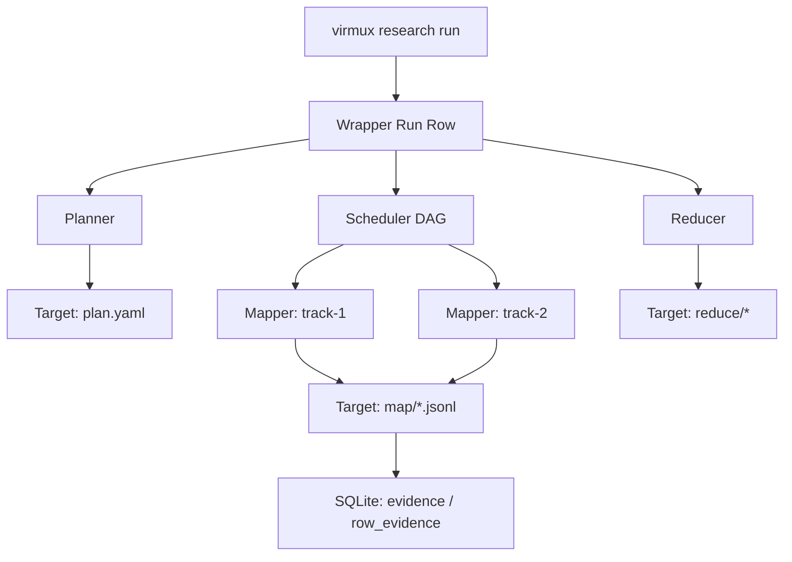

# ADR 006: Research Plane (Superagent Wedge)

**Status**: PROPOSED / IN-PROGRESS (WEDGE)  
**Context**: Scaling atomic skills to multi-step agents without context bloat or non-deterministic drift.  
**Deciders**: @haris, @antigravity

## 1. Thesis: The Wedge Law
Research is an **additive layer**, not a parallel stack. It MUST reuse the atomic `trace.ndjson`, `sqlite`, and `vsock` contracts. Any drift into a separate evidence plane is a hard-fail.

## 2. Architecture: Wrapper vs. Target
Execution logic is decoupled via a **Wrapper/Target** split to preserve deterministic lineage.



| Entity | Role | SoT |
| :--- | :--- | :--- |
| **Target Run** | Subject of research | `plan.yaml`, `map/`, `reduce/`, `evidence` SQL |
| **Wrapper Run** | Audit log of *operator* action | `trace.ndjson` (research.* events), `stdout` |

## 3. Core Decisions (Hard Contracts)

### 3.1 Plan-First Spine
*   **Hash Identity**: `PlanID = SHA256(canonical YAML)`.
*   **Persistence**: `plan.yaml` MUST be written and `research.plan.created` emitted BEFORE first tool RPC.
*   **Validation**: `yaml.UnmarshalStrict` + `dims_you_didnt_ask >= 4` mandatory floor.

### 3.2 Parallel Scheduler (DAG)
*   **Concurrency**: `errgroup` + semaphore-bounded topo execution.
*   **Fail-Closed**: Failure in node $N$ cascades to $Blocked$ for all children.
*   **Subset Execution**: `--only` selector validates ⊆ Plan. Deadlock detection on zero-progress sets.

### 3.3 Mapper/Reducer Purity
*   **Mapper**: Emits `TrackResultRow` (OK, Data, Error, Evidence). No prose outputs.
*   **Reducer**: Pure function of `map/*.jsonl` -> `reduce/*`. MUST emit `## Contradictions` (even if empty `None.`).

### 3.4 Replay & Parity
*   **Parity Rule**: JSON identity check on `TrackResultRow` (ignoring volatile IDs).
*   **Mismatch**: Persisted to `mismatch.json` for reducer reconciliation.
*   **Nondet Bypass**: Opt-in `deterministic: false` emits `research.replay.nondet_exception`, bypassing mismatch fail.

## 4. Integration Snips

### 4.1 CLI Dispatch (cmd/virmux/research.go)
```go
// Register target-run artifacts via shared helper
func (r *ResearchRunner) persist(path string) {
    persistRunArtifacts(r.TargetRunID, []string{path})
}
```

### 4.2 Scheduler (internal/skill/research/scheduler.go)
```go
// Blocked terminalization on subset mismatch
if len(pending) > 0 && activeWorkers == 0 {
    for _, id := range pending {
        r.markTrack(id, Blocked)
    }
    return nil // Zero-progress fail-closed
}
```

## 5. Hardening Gates (Non-Negotiable)
1.  **Cert**: `scripts/research_cert.sh` MUST pass (SQL, Docs, Portability).
2.  **Freshness**: SQL cert requires `--cert-ts`. Historical rows are non-authoritative.
3.  **DoD**: `scripts/spec06_dod_matrix.sh` deriving PASS from executable markers only (no literal "true").

## 6. Known Gaps (P1)
*   **Planner**: Current implementation is a stub/classifier.
*   **Budgeting**: Real-time `seconds/tokens` accounting missing in workers.
*   **Evidence**: Semantic extraction (quote_span) is mostly placeholder.
