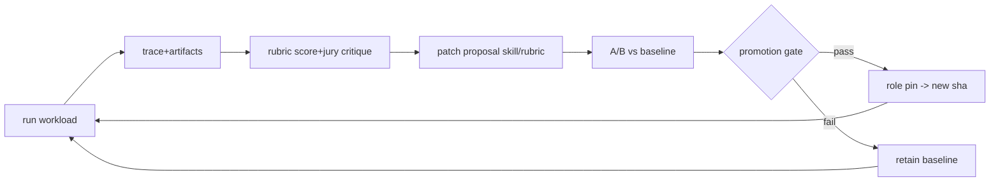
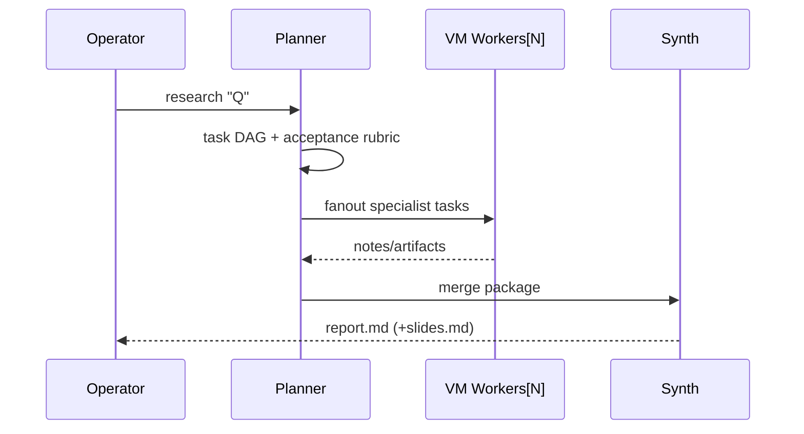

# RFC-000: GHOSTFLEET Compounding Agent OS (Firecracker+GitOps)

- Status: Draft/Proposed
- Date: 2026-02-22
- Owners: virmux core
- Source: `spec-0/00-spec.md`
- Thesis: agent value compounds only via `isolated exec + versioned skills + eval->promotion loop`; everything else commoditizes.

## 1. Position (opinionated)
Build the smallest system that reproduces winning market mechanics while deleting SaaS/UI bloat:
- Hyperagent mechanics clone: `skills refine`, `recommend save`, `role packaging`, `Slack proactive`, `fleet eval + A/B`.
- Superagent mechanics clone: `plan -> parallel specialists -> synth deliverable`.
- MCP stance: integrations are pluggable tool servers, not bespoke adapters.
- Compute stance: microVM isolation is non-negotiable; container-only agents are policy/code-exec theater.

## 2. Hard Invariants (MUST)
- Host: Linux/KVM; `/dev/kvm` rw.
- Runtime: Firecracker primary; QEMU only no-KVM fallback.
- Product surface: CLI/TUI only; no web UI/auth/multitenancy.
- Repo truth: skills/roles/rubrics/tests/logs are files + git history.
- Data: sqlite spine for runs/events/scores/artifacts/experiments/promotions.
- Browser tool: Playwright in guest.
- Execution semantics: per-run microVM; persistent per-agent volume + snapshot pointer.

## 3. Non-Goals (explicit)
- SaaS control plane.
- Human-collab features (RBAC, shared sessions, org tenancy).
- “Magical memory” APIs detached from file truth.
- Model novelty research.

## 4. System Shape
```text
operator(cli/tui)
  -> orchestrator(host/go)
    -> vmctl(firecracker,qemu-fallback)
      -> guest-runtime(tool rpc)
    -> store(sqlite)
    -> trace(ndjson/artifacts)
    -> judge(rubric engine + model adapters)
    -> slack gateway(events + speak gate)
    -> mcp gateway(client+server)

repo/
  skills/<name>/{prompt.md,tools.yaml,rubric.yaml,tests/*}
  roles/<role>.yaml
  runs/<run_id>/{trace.ndjson,stdout,artifacts/*}
  agents/<id>.json
  vm/images.lock
```

## 5. Control-Loop Contract (core moat)

Gate formula (v0): `promote iff p50_score↑ && fail_rate↓ && run_cost<=budget`.

## 6. Data Contract (minimal/strict)
```sql
runs(id pk, ts_start, ts_end, role, skill, model, status, cost_total, resume_mode, resume_error)
events(id pk, run_id fk, ts, type, payload_json)
tool_calls(id pk, run_id fk, seq, tool, input_hash, output_hash, dur_ms, ok, cost)
artifacts(id pk, run_id fk, kind, path, sha256, bytes)
scores(id pk, run_id fk, rubric, score_total, pass, critique)
experiments(id pk, name, baseline_ref, candidate_ref, metric_json)
promotions(id pk, target, from_ref, to_ref, reason, ts)
slack_events(id pk, channel, user, ts, event_json)
```
Rules: FK on; WAL on; append-only events/tool_calls; run state monotonic.

## 7. Skill = Software Artifact
Dir contract:
```text
skills/dd/
  prompt.md      # behavior
  tools.yaml     # allowlist + budgets/timeouts
  rubric.yaml    # weighted criteria + thresholds
  tests/         # fixtures + expected properties
```
Run contract:
1. Inputs + skill sha + model + toolset -> deterministic run envelope.
2. Tools blocked unless allowlisted.
3. Post-run emits score + patch suggestion.
4. Operator accepts patch -> git commit/branch.

## 8. Role Runtime (Slack ghost, default-silent)
`roles/<role>.yaml` fields:
```yaml
name: triage-ghost
skills: [triage, summarize]
trigger:
  channels: ["#incidents"]
  patterns: ["sev1", "outage"]
budget:
  max_cost_usd: 0.50
  max_tool_calls: 40
speak_gate:
  min_confidence: 0.82
  min_expected_utility: 0.65
  cooldown_sec: 900
```
Policy: evaluate every matching event, post only when gate passes; otherwise persist draft+reason.

## 9. Planner/Specialist Wedge

Success: quality up, wall-clock down with `N` until host saturation.

## 10. MCP Strategy
- Client mode: call external MCP servers as tools (`mcp.call(server,method,params)`).
- Server mode: expose fleet ops (`runs.query`,`skills.list`,`judge.run`,`ab.run`,`promote`).
- Consequence: integration growth via protocol compatibility, not product rewrites.

## 11. Operational Walkthroughs (compressed)
### A. “Boot + log”
```bash
ghostfleet doctor
ghostfleet vm run --cmd 'uname -a && echo ok'
# expect: run row + trace.ndjson (compat trace.jsonl symlink may exist) + stdout artifact
```
### B. “Skill loop”
```bash
ghostfleet skill run dd --input case.md
ghostfleet judge run <run_id>
ghostfleet skill refine suggest <run_id>
ghostfleet ab run exp.yaml
ghostfleet promote skill@<sha>
```
### C. “Ghost deploy”
```bash
ghostfleet slack recv --listen :8787
ghostfleet role enable triage-ghost
ghostfleet role status triage-ghost
```

## 12. Delivery Plan (40-day, hard outcomes)
- C1: substrate (`doctor`,`vm run`,`persistence`,`db spine`).
- C2: guest runtime + tool whitelist + trace packaging.
- C3: skill contract + runner + refine-suggest + skill-suggest.
- C4: rubric/judge + A/B + promotion gate.
- C5: planner->parallel->synth wedge.
- C6: Slack ingest + role runtime + speak gate + TUI controls.
- C7: MCP client/server.
- C8: TUI command center + one-key workflows + golden 3-min demo.

## 13. Acceptance Criteria (ship/no-ship)
- Reproduces mechanics: skills refine/save, role packaging, proactive-but-gated Slack, fleet eval+A/B.
- Reproduces wedge: plan->parallel specialists->deliverable.
- Reproduces interop: MCP tool graph pluggability.
- Reproduces speed: snapshot/restore materially reduces rerun latency.

## 14. Risks + Countermeasures
- Snapshot fragility -> mandatory cold-boot fallback + telemetry truth (`resume_mode`,`resume_error`).
- Slack spam risk -> conservative speak gate + channel cooldown + budget caps.
- Eval drift/gaming -> frozen eval sets + blinded A/B + cost-normalized metrics.
- Tool nondeterminism -> I/O hashing + replay mode + explicit mutation flags.
- Over-planning latency -> bounded planner token/cost; force execution deadlines.

## 15. Architectural Doctrine (non-negotiable)
- Thin command surface, thick contracts.
- Every feature must emit machine-checkable evidence.
- No hidden state; repo+sqlite are truth.
- Favor explicit fallback over brittle purity.
- If it cannot be benchmarked, it is not real.
